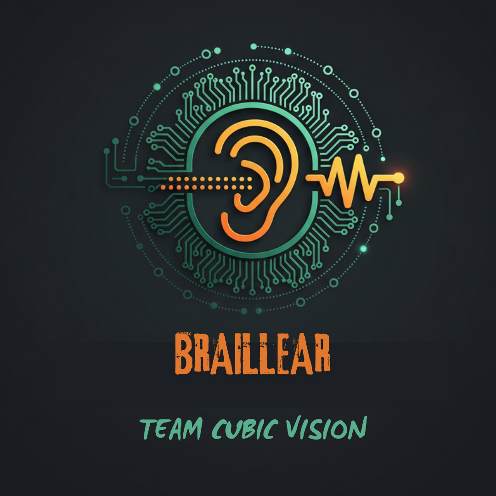

# BRAILLEAR - Smart Touch-to-Speech Learning System

<div align="center">



**Revolutionizing Braille education through embedded systems and real-time audio feedback**

[](https://opensource.org/licenses/MIT)
[](https://www.typescriptlang.org/)
[](https://reactjs.org/)
[](https://vitejs.dev/)

</div>

---

## 📋 Table of Contents

- [Overview](#overview)
- [Problem Statement](#problem-statement)
- [Solution](#solution)
- [Key Features](#key-features)
- [Technology Stack](#technology-stack)
- [System Architecture](#system-architecture)
- [Installation & Setup](#installation--setup)
- [Hardware Requirements](#hardware-requirements)
- [Usage Guide](#usage-guide)
- [Development](#development)
- [Project Structure](#project-structure)
- [API Reference](#api-reference)
- [Accessibility](#accessibility)
- [Deployment](#deployment)
- [Testing](#testing)
- [Contributing](#contributing)
- [Documentation](#documentation)
- [Troubleshooting](#troubleshooting)
- [Roadmap](#roadmap)
- [License](#license)
- [Acknowledgments](#acknowledgments)

---

## 🎯 Overview

**BRAILLEAR** is an innovative, affordable, and accessible learning system designed to empower visually impaired individuals in their Braille literacy journey. By combining embedded hardware with real-time audio feedback, BRAILLEAR creates a multisensory learning experience that accelerates Braille education while remaining economically viable.

### Mission

To make inclusive education accessible to millions of visually impaired learners worldwide through affordable, technology-driven solutions that promote independence and learning autonomy.

### Vision

A world where every visually impaired individual has access to effective, affordable, and interactive Braille learning tools that enable them to achieve literacy and independence.

---

## 🔍 Problem Statement

Visually impaired individuals face significant barriers in accessing effective Braille education:

- **High Cost**: Traditional Braille learning systems are expensive (often ₹50,000+), making them inaccessible to many
- **Limited Feedback**: Lack of real-time audio feedback hinders independent learning
- **Bulkiness**: Existing devices are large, non-portable, and difficult to transport
- **Maintenance Complexity**: Complex systems require frequent maintenance and technical support
- **Regional Limitations**: Many solutions are region-specific and not globally accessible
- **Technology Gap**: Limited integration of modern embedded systems in educational tools

---

## 💡 Solution

BRAILLEAR addresses these challenges through:

1. **Affordable Design**: Cost-effective solution under ₹2,000, making it 25x more affordable than traditional systems
2. **Real-Time Feedback**: <200ms latency audio feedback for immediate learning reinforcement
3. **Portable & Wireless**: Rechargeable battery with Type-C charging for mobile usage
4. **Open-Source**: Community-driven development encourages innovation and customization
5. **Modern Technology**: Raspberry Pi Pico (RP2040) ensures reliable, efficient operation
6. **Accessible Design**: WCAG-compliant web interface with full keyboard navigation

---

## ✨ Key Features

### Core Functionality

- **🖐️ Touch-Based Learning**: 36 TTP223 capacitive sensors mapped to A-Z (26 letters) and 0-9 (10 numbers)
- **🔊 Real-Time Audio Feedback**: Immediate phonetic playback with <200ms latency
- **🔌 Hardware Integration**: Web Serial API support for direct browser-to-device communication
- **🎮 Demo Mode**: Comprehensive simulation for testing without physical hardware
- **♿ Accessible Design**: WCAG 2.1 AA compliant with ARIA labels and keyboard navigation
- **📊 Event Logging**: Timestamped activity tracking with export functionality

### Web Application Features

- **🏠 Landing Page**: Comprehensive project overview with accessibility focus
- **🔐 Authentication**: Email/password login with JWT simulation
- **📊 Dashboard**: Main interface with hardware status, sensor grid, and controls
- **🎛️ Sensor Grid**: Visual representation of all 36 sensors with interactive testing
- **📝 Event Log**: Real-time activity tracking with filtering and export
- **🎵 Audio Controls**: Volume management and playback settings
- **⚙️ Settings Panel**: User preferences and hardware configuration

### Hardware Features

- **⚡ Raspberry Pi Pico**: RP2040 dual-core processor for reliable sensor management
- **🔋 Portable Power**: 3.7V-5V rechargeable battery with Type-C charging
- **📡 UART Communication**: 9600 baud serial communication for real-time data transfer
- **🎯 Interrupt-Based Detection**: Efficient GPIO interrupt handling for instant response
- **🔧 Modular Design**: Easy to assemble and customize

---

## 🛠️ Technology Stack

### Frontend

| Technology | Version | Purpose |
|------------|---------|---------|
| **React** | 19.1.1 | UI framework with hooks |
| **TypeScript** | 5.5.3 | Type-safe development |
| **Vite** | 5.4.1 | Build tool and dev server |
| **Tailwind CSS** | 3.4.11 | Utility-first styling |
| **shadcn/ui** | Latest | Accessible component library |
| **React Router** | 6.26.2 | Client-side routing |
| **Zustand** | 4.5.0 | State management |
| **TanStack Query** | 5.56.2 | Data fetching and caching |

### Audio System

- **Web Audio API**: Low-latency audio playback
- **AudioContext**: Real-time audio processing
- **Synthetic Audio**: Demo mode tone generation

### Hardware Communication

- **Web Serial API**: Direct browser-to-device communication
- **UART Protocol**: 9600 baud serial communication
- **Event-Driven Architecture**: Interrupt-based sensor detection

### Development Tools

- **ESLint**: Code linting and quality checks
- **TypeScript**: Static type checking
- **PostCSS**: CSS processing
- **Autoprefixer**: CSS vendor prefixing

---

## 🏗️ System Architecture

### High-Level Architecture

```
┌─────────────────────────────────────────────────────────────┐
│                     Web Application                          │
│  ┌──────────────┐  ┌──────────────┐  ┌──────────────┐     │
│  │   React UI   │  │ Audio Manager│  │Serial Manager│     │
│  │  Components  │  │              │  │              │     │
│  └──────────────┘  └──────────────┘  └──────────────┘     │
│         │                 │                  │              │
│         └─────────────────┴──────────────────┘             │
│                            │                                │
└────────────────────────────┼────────────────────────────────┘
                             │
                    Web Serial API
                             │
┌────────────────────────────┼────────────────────────────────┐
│                    Hardware Layer                            │
│  ┌──────────────────────────────────────────────────────┐  │
│  │         Raspberry Pi Pico (RP2040)                   │  │
│  │  ┌──────────────┐  ┌──────────────┐  ┌────────────┐ │  │
│  │  │ GPIO 0-25    │  │ GPIO 26-35   │  │   UART     │ │  │
│  │  │ (A-Z)        │  │ (0-9)        │  │  (9600)    │ │  │
│  │  └──────────────┘  └──────────────┘  └────────────┘ │  │
│  └──────────────────────────────────────────────────────┘  │
│                            │                                │
│  ┌──────────────────────────────────────────────────────┐  │
│  │           36x TTP223 Capacitive Sensors              │  │
│  │  ┌────┐ ┌────┐ ┌────┐  ...  ┌────┐ ┌────┐ ┌────┐    │  │
│  │  │ A  │ │ B  │ │ C  │       │ X  │ │ Y  │ │ Z  │    │  │
│  │  └────┘ └────┘ └────┘       └────┘ └────┘ └────┘    │  │
│  │  ┌────┐ ┌────┐ ┌────┐  ...  ┌────┐ ┌────┐ ┌────┐    │  │
│  │  │ 0  │ │ 1  │ │ 2  │       │ 7  │ │ 8  │ │ 9  │    │  │
│  │  └────┘ └────┘ └────┘       └────┘ └────┘ └────┘    │  │
│  └──────────────────────────────────────────────────────┘  │
└────────────────────────────────────────────────────────────┘
```

### Data Flow

1. **Touch Detection**: TTP223 sensor detects user touch
2. **GPIO Interrupt**: Raspberry Pi Pico receives interrupt signal
3. **Character Mapping**: Microcontroller maps GPIO pin to character (A-Z, 0-9)
4. **UART Transmission**: Character data sent via serial communication
5. **Web Serial Reception**: Browser receives data through Web Serial API
6. **Audio Playback**: AudioManager plays corresponding phonetic audio
7. **UI Update**: Dashboard updates with event log and visual feedback

---

## 🚀 Installation & Setup

### Prerequisites

- **Node.js**: Version 18.0 or higher
- **Package Manager**: pnpm 8.10.0 (recommended) or npm/yarn
- **Modern Browser**: Chrome 89+, Edge 89+, or Opera 75+ (for Web Serial API)
- **Optional**: BRAILLEAR hardware device for full functionality

### Step 1: Clone the Repository

```bash
git clone https://github.com/braillear/webapp.git
cd BRAILLEAR
```

### Step 2: Navigate to Project Directory

```bash
cd Prototype/Prototype\ 1/workspace/shadcn-ui
```

### Step 3: Install Dependencies

```bash
# Using pnpm (recommended)
pnpm install

# Or using npm
npm install

# Or using yarn
yarn install
```

### Step 4: Start Development Server

```bash
# Using pnpm
pnpm run dev

# Or using npm
npm run dev

# Or using yarn
yarn dev
```

The application will be available at `http://localhost:5173`

### Step 5: Build for Production

```bash
# Build optimized production bundle
pnpm run build

# Preview production build locally
pnpm run preview
```

---

## 🔧 Hardware Requirements

### Components List

| Component | Quantity | Purpose | Approx. Cost |
|-----------|----------|---------|--------------|
| Raspberry Pi Pico (RP2040) | 1 | Main microcontroller | ₹300 |
| TTP223 Capacitive Touch Sensor | 36 | Touch detection (A-Z, 0-9) | ₹1,080 |
| 3.7V-5V Rechargeable Battery | 1 | Portable power source | ₹200 |
| Type-C Charging Module | 1 | Battery charging | ₹100 |
| Jumper Wires | 50+ | Connections | ₹150 |
| Breadboard | 1 | Prototyping | ₹100 |
| Resistors (10kΩ) | 36 | Pull-up resistors | ₹50 |
| **Total** | - | - | **~₹1,980** |

### Hardware Setup

#### Step 1: Flash MicroPython

1. Download MicroPython firmware for Raspberry Pi Pico
2. Hold BOOTSEL button while connecting to computer
3. Flash firmware using Thonny IDE or `uf2` file method

#### Step 2: Wiring Configuration

```
Raspberry Pi Pico Pinout:
┌─────────────────────────────────────┐
│  GPIO 0-25   →  Sensors A-Z (26)    │
│  GPIO 26-35  →  Sensors 0-9 (10)    │
│  3.3V        →  VCC (all sensors)   │
│  GND         →  GND (all sensors)   │
│  UART TX     →  USB Serial TX       │
│  UART RX     →  USB Serial RX       │
└─────────────────────────────────────┘

TTP223 Sensor Connections:
┌─────────────────────────────────────┐
│  VCC  →  3.3V (Pico)                │
│  GND  →  GND (Pico)                 │
│  SIG  →  GPIO Pin (0-35)            │
│  A0   →  GND (toggle mode)          │
└─────────────────────────────────────┘
```

#### Step 3: Firmware Installation

1. Upload BRAILLEAR firmware code to Raspberry Pi Pico
2. Configure GPIO pins for sensors A-Z (pins 0-25) and 0-9 (pins 26-35)
3. Set UART communication at 9600 baud rate
4. Test sensor connections individually

#### Step 4: Power Setup

1. Connect rechargeable battery to Type-C charging module
2. Connect battery output to Pico's VBUS pin (5V) or VSYS (3.3V)
3. Ensure proper voltage regulation
4. Test charging functionality

---

## 📖 Usage Guide

### Demo Mode (No Hardware Required)

1. **Start the Application**
   ```bash
   pnpm run dev
   ```

2. **Access the Application**
   - Open browser to `http://localhost:5173`
   - Navigate to Login page

3. **Sign In**
   - Enter any email and password (demo authentication)
   - Click "Sign In"

4. **Enable Demo Mode**
   - Go to Dashboard
   - Click "Start Demo Mode" in Serial Panel
   - Optionally enable "Auto-Play" for automatic simulation

5. **Test Sensors**
   - Click any sensor button in the Sensor Grid
   - Listen for audio feedback
   - View events in the Event Log

### Hardware Mode (With Physical Device)

1. **Connect Hardware**
   - Connect Raspberry Pi Pico to computer via USB
   - Ensure firmware is loaded and sensors are wired

2. **Open Application**
   - Navigate to Dashboard
   - Click "Connect Hardware" button

3. **Grant Permissions**
   - Browser will prompt for serial port access
   - Select your Raspberry Pi Pico device
   - Click "Connect"

4. **Start Learning**
   - Touch physical sensors on the device
   - Audio feedback will play automatically
   - Events will appear in the Event Log

### Features Overview

#### Dashboard Tabs

- **Overview**: Connection status, event log, quick stats
- **Sensors**: Interactive sensor grid for testing
- **Audio**: Audio player controls and event history
- **Settings**: User preferences and configuration

#### Audio Controls

- **Volume Slider**: Adjust audio volume (0-100%)
- **Playback Settings**: Configure audio behavior
- **Test Audio**: Play sample audio for each character

#### Event Log

- **Real-Time Updates**: See events as they occur
- **Filtering**: Filter by character, source, or time
- **Export**: Download event log as CSV or JSON

---

## 💻 Development

### Development Setup

1. **Fork the Repository**
   ```bash
   git fork https://github.com/braillear/webapp.git
   ```

2. **Create Feature Branch**
   ```bash
   git checkout -b feature/amazing-feature
   ```

3. **Install Dependencies**
   ```bash
   pnpm install
   ```

4. **Start Development Server**
   ```bash
   pnpm run dev
   ```

5. **Make Changes**
   - Edit files in `src/` directory
   - Changes will hot-reload automatically

6. **Run Linting**
   ```bash
   pnpm run lint
   ```

7. **Commit Changes**
   ```bash
   git add .
   git commit -m "Add amazing feature"
   ```

8. **Push to Branch**
   ```bash
   git push origin feature/amazing-feature
   ```

9. **Open Pull Request**
   - Navigate to GitHub repository
   - Click "New Pull Request"
   - Fill in description and submit

### Code Standards

- **TypeScript**: Strict type checking enabled
- **ESLint**: Code quality and consistency
- **Prettier**: Automatic code formatting (if configured)
- **Component Structure**: Functional components with hooks
- **File Naming**: PascalCase for components, camelCase for utilities

### Project Structure

```
BRAILLEAR/
├── Documentation/              # Project documentation PDFs
│   ├── Abstract.pdf
│   ├── Problem Statement.pdf
│   ├── Solution.pdf
│   ├── System Architecture.pdf
│   └── ...
├── Prototype/
│   └── Prototype 1/
│       ├── build/              # Production builds (v3, v4, v5)
│       └── workspace/
│           └── shadcn-ui/      # Main application
│               ├── public/     # Static assets
│               │   ├── audio/  # Audio files
│               │   └── images/ # Images
│               ├── src/
│               │   ├── components/  # React components
│               │   │   ├── ui/      # shadcn/ui components
│               │   │   ├── AudioPlayer.tsx
│               │   │   ├── EventLog.tsx
│               │   │   ├── Header.tsx
│               │   │   ├── SensorGrid.tsx
│               │   │   ├── SerialPanel.tsx
│               │   │   └── Settings.tsx
│               │   ├── hooks/       # Custom React hooks
│               │   ├── lib/        # Utility libraries
│               │   │   ├── audioManager.ts
│               │   │   ├── auth.ts
│               │   │   ├── serialManager.ts
│               │   │   └── utils.ts
│               │   ├── pages/      # Page components
│               │   │   ├── Contact.tsx
│               │   │   ├── Dashboard.tsx
│               │   │   ├── Index.tsx
│               │   │   ├── Landing.tsx
│               │   │   ├── Login.tsx
│               │   │   └── NotFound.tsx
│               │   ├── App.tsx     # Main app component
│               │   └── main.tsx    # Entry point
│               ├── package.json
│               ├── tsconfig.json
│               ├── vite.config.ts
│               └── tailwind.config.ts
├── Logo.png
├── Header.png
└── README.md
```

---

## 📚 API Reference

### SerialManager

Manages hardware communication and demo mode simulation.

```typescript
import { serialManager } from '@/lib/serialManager';

// Connect to hardware device
const success = await serialManager.connectToHardware();

// Start demo mode
serialManager.startDemo(autoPlay: boolean, interval: number);

// Stop demo mode
serialManager.stopDemo();

// Simulate touch event
serialManager.simulateTouch('A');

// Listen for events
const unsubscribe = serialManager.onEvent((event: SerialEvent) => {
  console.log(`Character: ${event.character}`);
  console.log(`Source: ${event.source}`);
  console.log(`Timestamp: ${event.timestamp}`);
});

// Listen for status changes
const unsubscribe = serialManager.onStatusChange((status: ConnectionStatus) => {
  console.log(`Status: ${status}`);
});

// Get current status
const status = serialManager.getStatus();

// Check Web Serial API support
const isSupported = serialManager.isWebSerialSupported();
```

### AudioManager

Handles audio playback and volume control.

```typescript
import { audioManager } from '@/lib/audioManager';

// Play character audio
await audioManager.playCharacter('A');

// Set volume (0-1)
audioManager.setVolume(0.7);

// Get current volume
const volume = audioManager.getVolume();

// Resume audio context (required after user interaction)
await audioManager.resumeContext();
```

### AuthManager

Manages user authentication and preferences.

```typescript
import { authManager } from '@/lib/auth';

// Login user
const result = await authManager.login({
  email: 'user@example.com',
  password: 'password',
  rememberMe: true
});

// Logout user
authManager.logout();

// Get current user
const user = authManager.getCurrentUser();

// Update user preferences
authManager.updatePreferences({
  audioVolume: 0.8,
  demoMode: true
});

// Listen for auth state changes
const unsubscribe = authManager.onAuthStateChange((user: User | null) => {
  console.log('User:', user);
});
```

---

## ♿ Accessibility

### WCAG 2.1 AA Compliance

BRAILLEAR is designed with accessibility as a core principle:

- **High Contrast**: Professional navy/teal color scheme with 4.5:1 contrast ratio
- **Large Touch Targets**: Minimum 44x44px interactive elements
- **Keyboard Navigation**: Full keyboard accessibility with logical tab order
- **Screen Reader Support**: Comprehensive ARIA labels and live regions
- **Focus Management**: Clear focus indicators and visible focus states
- **Semantic HTML**: Proper heading hierarchy and landmark regions

### Assistive Technology Features

- **Screen Reader Announcements**: Real-time audio playback notifications
- **Keyboard Shortcuts**: Quick access to main functions
- **Voice Feedback**: Audio confirmation for all interactions
- **Customizable Settings**: Volume, contrast, and text size adjustments
- **Skip Links**: Quick navigation to main content

### Testing Accessibility

```bash
# Run accessibility audits (if configured)
pnpm run test:a11y

# Manual testing checklist:
# - [ ] All interactive elements keyboard accessible
# - [ ] Screen reader announces all dynamic content
# - [ ] Color contrast meets WCAG AA standards
# - [ ] Focus indicators visible on all elements
# - [ ] Forms have proper labels and error messages
```

---

## 🚢 Deployment

### Production Build

```bash
# Build optimized production bundle
pnpm run build

# Output will be in dist/ directory
```

### Docker Deployment

Create a `Dockerfile`:

```dockerfile
FROM node:18-alpine AS builder
WORKDIR /app
COPY package*.json pnpm-lock.yaml ./
RUN npm install -g pnpm && pnpm install
COPY . .
RUN pnpm run build

FROM nginx:alpine
COPY --from=builder /app/dist /usr/share/nginx/html
COPY nginx.conf /etc/nginx/nginx.conf
EXPOSE 80
CMD ["nginx", "-g", "daemon off;"]
```

### Environment Variables

Create `.env.production`:

```bash
VITE_API_BASE_URL=https://api.braillear.org
VITE_WS_URL=wss://ws.braillear.org
VITE_SENTRY_DSN=your-sentry-dsn
```

### Deployment Platforms

- **Vercel**: Automatic deployments from GitHub
- **Netlify**: Continuous deployment with build hooks
- **GitHub Pages**: Static site hosting
- **AWS S3 + CloudFront**: Scalable static hosting
- **Docker**: Containerized deployment

---

## 🧪 Testing

### Unit Tests

```bash
# Run unit tests (if configured)
pnpm run test

# Run tests with coverage
pnpm run test:coverage
```

### E2E Tests

```bash
# Run end-to-end tests (if configured)
pnpm run test:e2e
```

### Manual Testing Checklist

- [ ] Demo mode works without hardware
- [ ] Hardware connection works with physical device
- [ ] Audio playback for all characters (A-Z, 0-9)
- [ ] Event log captures all interactions
- [ ] Settings persist across sessions
- [ ] Authentication flow works correctly
- [ ] All pages are accessible
- [ ] Keyboard navigation works throughout
- [ ] Screen reader compatibility verified

---

## 🤝 Contributing

We welcome contributions from the community! Here's how you can help:

### Ways to Contribute

1. **Report Bugs**: Open an issue with detailed bug reports
2. **Suggest Features**: Share your ideas for improvements
3. **Submit Code**: Contribute code improvements and new features
4. **Improve Documentation**: Help make our docs better
5. **Test**: Help us test new features and report issues
6. **Spread the Word**: Share BRAILLEAR with others

### Contribution Guidelines

1. **Fork the Repository**
2. **Create a Feature Branch**: `git checkout -b feature/amazing-feature`
3. **Follow Code Standards**: Use TypeScript, follow ESLint rules
4. **Write Tests**: Add tests for new features
5. **Update Documentation**: Update README or docs as needed
6. **Commit Changes**: Use clear, descriptive commit messages
7. **Push to Branch**: `git push origin feature/amazing-feature`
8. **Open Pull Request**: Provide detailed description of changes

### Code of Conduct

- Be respectful and inclusive
- Welcome newcomers and help them learn
- Focus on constructive feedback
- Respect different viewpoints and experiences

---

## 📄 Documentation

### Available Documentation

The `Documentation/` folder contains comprehensive PDFs:

- **Abstract.pdf**: Project overview and summary
- **Problem Statement.pdf**: Detailed problem analysis
- **Solution.pdf**: Technical solution description
- **System Architecture.pdf**: System design and architecture
- **Tech Stack.pdf**: Technology choices and rationale
- **Key Features & USP.pdf**: Unique selling points
- **Feasibility & Viability.pdf**: Project feasibility analysis
- **Impact and Benefits.pdf**: Social and educational impact
- **Future Aspects.pdf**: Roadmap and future plans
- **Patent Claims.pdf**: Intellectual property information
- **Conclusion.pdf**: Project summary and conclusions

### Additional Resources

- [Getting Started Guide](docs/getting-started.md) (if available)
- [Hardware Setup Guide](docs/hardware-setup.md) (if available)
- [API Documentation](docs/api.md) (if available)
- [Contributing Guidelines](docs/contributing.md) (if available)

---

## 🐛 Troubleshooting

### Common Issues

#### Web Serial API Not Working

**Problem**: Cannot connect to hardware device

**Solutions**:
- Ensure you're using Chrome 89+, Edge 89+, or Opera 75+
- Check that the site is served over HTTPS (or localhost)
- Verify hardware device is connected and recognized by OS
- Grant serial port permissions when prompted
- Try disconnecting and reconnecting the device

#### Audio Not Playing

**Problem**: No audio feedback when touching sensors

**Solutions**:
- Click anywhere on the page to initialize AudioContext (browser requirement)
- Check browser audio permissions in settings
- Verify volume settings in both app and system
- Check browser console for audio-related errors
- Ensure audio files exist in `public/audio/` directory

#### Demo Mode Not Responding

**Problem**: Demo mode doesn't simulate events

**Solutions**:
- Refresh the page and try again
- Check browser console for JavaScript errors
- Ensure demo mode is properly activated
- Try disabling and re-enabling demo mode
- Clear browser cache and reload

#### Hardware Connection Issues

**Problem**: Cannot establish serial connection

**Solutions**:
- Verify Raspberry Pi Pico is properly connected via USB
- Check that firmware is loaded correctly
- Ensure UART baud rate matches (9600)
- Test serial connection with external tool (e.g., PuTTY)
- Check device manager for COM port recognition

### Getting Help

- **📧 Email**: support@braillear.org
- **💬 Discord**: [BRAILLEAR Community](https://discord.gg/braillear)
- **🐛 Issues**: [GitHub Issues](https://github.com/braillear/webapp/issues)
- **📖 Docs**: [Documentation Site](https://docs.braillear.org)
- **🌐 Website**: [BRAILLEAR.org](https://braillear.org)

---

## 🗺️ Roadmap

### Phase 1: Foundation (Current) ✅

- [x] Web application with demo mode
- [x] Web Serial API integration
- [x] Accessible design implementation
- [x] Audio feedback system
- [x] Basic hardware support

### Phase 2: Enhancement (Next) 🔄

- [ ] Mobile application (Flutter/React Native)
- [ ] Bluetooth connectivity (ESP32 integration)
- [ ] Cloud synchronization and progress tracking
- [ ] Multilingual audio support
- [ ] Advanced analytics dashboard
- [ ] User progress reports

### Phase 3: Advanced Features (Future) 📋

- [ ] AI-powered adaptive learning
- [ ] Advanced analytics and reporting
- [ ] Integration with educational platforms
- [ ] Hardware manufacturing partnerships
- [ ] Multi-language support
- [ ] Gamification elements
- [ ] Social learning features

### Phase 4: Scale (Future) 🚀

- [ ] Global distribution network
- [ ] Educational institution partnerships
- [ ] Research collaboration programs
- [ ] Open hardware certification
- [ ] Community-driven improvements

---

## 📜 License

This project is licensed under the **MIT License** - see the [LICENSE](LICENSE) file for details.

### License Summary

- ✅ Commercial use
- ✅ Modification
- ✅ Distribution
- ✅ Private use
- ❌ Liability
- ❌ Warranty

---

## 🙏 Acknowledgments

### Team

- **Team Cubic Vision**: Original project developers and visionaries
- **Contributors**: All developers who have contributed to BRAILLEAR

### Community

- **Open Source Community**: Contributors, testers, and supporters
- **Accessibility Experts**: Guidance on inclusive design principles
- **Educational Partners**: Schools and organizations providing feedback
- **Beta Testers**: Early adopters who helped refine the system

### Technologies

- **React Team**: For the amazing React framework
- **Vite Team**: For the fast build tool
- **shadcn/ui**: For accessible component library
- **Raspberry Pi Foundation**: For the Pico microcontroller
- **Web Standards**: For Web Serial API and Web Audio API

### Inspiration

- **UN SDG Goal 4**: Quality Education for All
- **Accessibility Advocates**: Champions of inclusive technology
- **Braille Community**: Learners and educators who inspire us

---

## 📞 Contact & Links

- **🌐 Website**: [braillear.org](https://braillear.org)
- **📧 Email**: contact@braillear.org
- **💬 Discord**: [BRAILLEAR Community](https://discord.gg/braillear)
- **🐙 GitHub**: [github.com/braillear](https://github.com/braillear)
- **📖 Documentation**: [docs.braillear.org](https://docs.braillear.org)
- **🐛 Issues**: [GitHub Issues](https://github.com/braillear/webapp/issues)

---

<div align="center">

**BRAILLEAR** - Empowering visually impaired learners through technology-driven inclusivity.

Made with ❤️ by Team Cubic Vision

[](https://braillear.org)
[](https://github.com/braillear)
[](https://discord.gg/braillear)

</div>

---

**Last Updated**: December 2024  
**Version**: 1.0.0  
**Status**: Active Development


